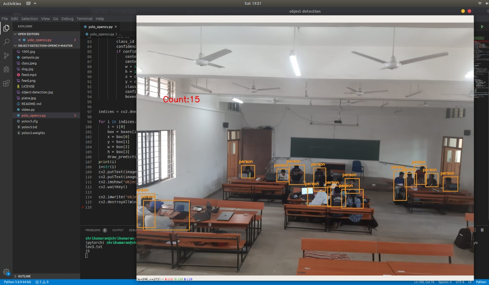

# Occupancy-based-smart-classroom

## Deep learning based occupants counter
We implement a method to count the number of occupants in the room from the given video feed of the room. We use a YOLOv3 model as our backbone. The model detects humans in the room, and we count the number of predictions in each frame to give out the final count.

## Running locally
* Download pretrained YOLOv3 weights and it's config files from the below link.
https://pjreddie.com/darknet/yolo/
* Install OpenCV
* To run inference on an image, run the below command in your terminal:
python video.py --image <image_path> --config <yolo_config_path> --weights <yolo_weights_path> --classes <no_of_class>

## Future improvements
* Currently this model runs just using OpenCV and DNN modules, we can speed it up by using TFLite.
* Using more latest object detection models like YOLOv5 or FRCNN.
 

 
